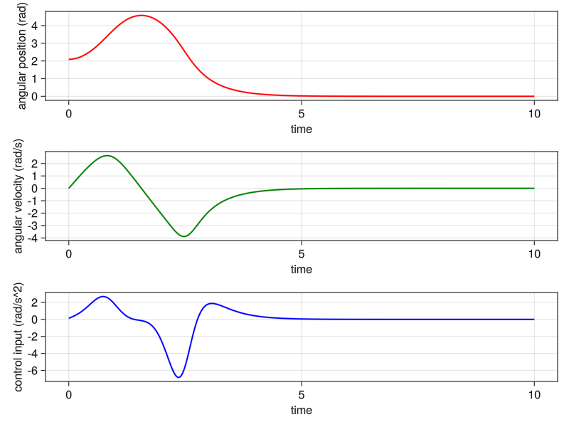
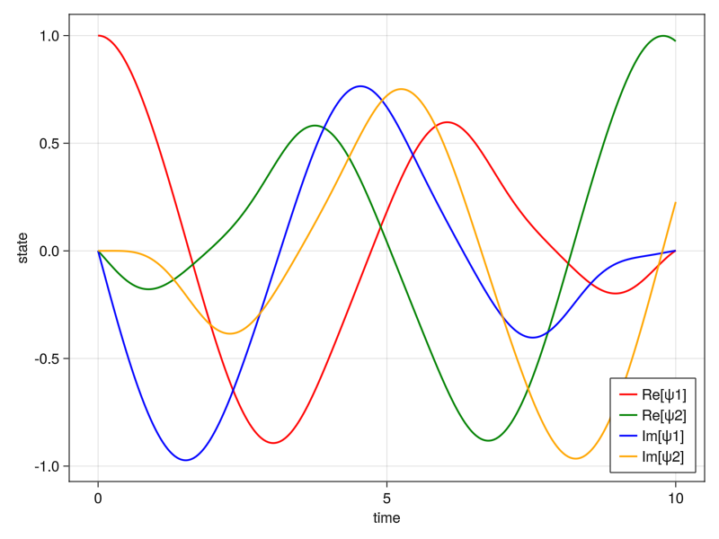
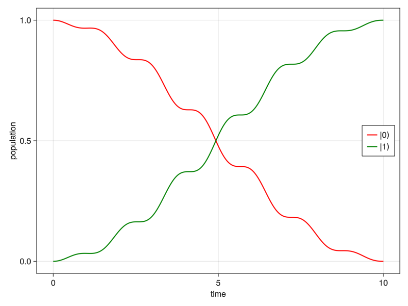

# PRONTO.jl
Hello and welcome to the julia implementation of the **PR**ojection-**O**perator-Based **N**ewton’s Method for **T**rajectory **O**ptimization (PRONTO).
## Inverted Pendulum
We consider a simple inverted pendulum system
```math
\dot{x} = \begin{bmatrix}\dot{x_1} \\\dot{x_2}\end{bmatrix} = \begin{bmatrix}x_2 \\\frac{g}{L}\sin{x_1} - \frac{u}{L}\cos{x_1}\end{bmatrix},
```
where $x_1$ [rad] is the angular position, $x_2$ [rad/s] is the angular velocity and $u$ [m/s^2] is the control input (the acceleration of the pivot point). Assume the pendulum starts at the initial condition $x_0 = [\frac{2\pi}{3},0]^T$ at time $t=0$ and we wish the pendulum goes to the equilibrium point $x_e = [0,0]^T$ at time $t=10$. To compute such a control law $u(t)$, we solve the OCP:
```math
\min h(\xi) = m(x(T)) + \int^T_0 l(x(t),u(t),t) dt \\s.t. \quad \dot{x} = f(x,u,t), \qquad x(0) = x_0.
```
First, we load some dependencies:
```julia
using PRONTO
using LinearAlgebra
using StaticArrays
using Base: @kwdef
```

Now we can define our model for this inverted pendulum. We decide to name our model `InvPend`, where `{2,1}` represents the 2 state vector $x$, the single control input $u$; `L` is the length of the pendulum and `g` is the gravity acceleration on earth. 
```julia
@kwdef struct InvPend <: Model{2,1} 
    L::Float64 = 2 
    g::Float64 = 9.81 
    Q::SMatrix{2,2,Float64} = I(2) 
    R::SMatrix{1,1,Float64} = I(1) 
    P::SMatrix{2,2,Float64} = I(2)
end
```
Then we can define our OCP, where the dynamics $f = \dot{x}$, the incremental cost $l = \frac{1}{2}x^TQx+\frac{1}{2}u^TRu$, and the terminal cost $m = \frac{1}{2}x^TPx$.
```julia
@define_f InvPend [ 
    x[2], 
    g/L*sin(x[1])-u[1]*cos(x[1])/L,
    ]
@define_l InvPend 1/2*x'*Q*x + 1/2*u'*R*u
@define_m InvPend 1/2*x'*P*x
```
Next we define a LQR for the projection operator. In this case, we only need to define `Q` and `R`; `P` is computed by ARE around the equilibrium point.
```julia
@define_Qr InvPend diagm([10, 1])
@define_Rr InvPend diagm([1e-3])
```
Last we compute the Lagrange dynamics $L = l + \lambda^Tf$.
```julia
resolve_model(InvPend)
```
Now we can solve this OCP! We load the parameter `θ`, the time horizon `τ` and the inital condition `x0`. For this OCP, our intial guess does NOT have to be a trajectory! We assume a pair of state-and-input curve `α` and `μ`, which is NOT a trajectory, but we can obtain `η`, which is the output from the projection operator.
```julia
θ = InvPend() 
τ = t0,tf = 0,10
x0 = @SVector [2π/3;0]
xe = @SVector [0;0]
u0 = @SVector [0.0]
α = t->xe
μ = t->u0
η = closed_loop(θ,x0,α,μ,τ)
```
The desired OCP is solved!
```julia
ξ,data = pronto(θ,x0,η,τ; tol=1e-3);
```
We can plot the optimal results:

## Qubit: State to State Transfer
We consider the Schrödinger equation
```math
i|\dot{\psi}(t)\rangle = (\mathcal{H_0} + \phi(t)\mathcal{H_1})|\psi(t)\rangle,
```
where $\mathcal{H_0} = \sigma_z = \begin{bmatrix}0 & 1 \\1 & 0\end{bmatrix}$, and $\mathcal{H_1} = \sigma_y = \begin{bmatrix}0 & -i \\i & 0\end{bmatrix}$ are the Pauli matrices. The real control input $\phi(t)$ drives the system between 2 qubit states $|0\rangle$ and $|1\rangle$, which are the two eigenstates of the free Hamiltonian $\mathcal{H_0}$. We wish to find the optimal control input $\phi^{\star}(t)$ that performs the state-to-state transfer from $|0\rangle$ to $|1\rangle$. To do this, we will solve:
```math
\min h(\xi) = p(x(T)) + \int^T_0 l(x(t),u(t),t) dt \\s.t. \quad \dot{x} = f(x,u,t), x(0) = x_0,\\\text{where:} \quad \xi(\cdot) = [x(\cdot);u(\cdot)]
```
First, we load some dependencies:
```julia
using PRONTO
using LinearAlgebra
using StaticArrays
using Base: @kwdef
```
Note that $|\psi \rangle$ is a $2 \times 1$ complex vector, and we wish to have the state vector $x$ in the real form. We can define our state vector 
```math
x = \begin{bmatrix}Re(|\psi\rangle)\\Im(|\psi\rangle) \end{bmatrix},
``` 
which in this case is a $4 \times 1$ vector of real numbers. Moreover, any complex square matrix $\mathcal{H}$ can be represented in its real form:
```math
H_{re} = \begin{bmatrix}Re(\mathcal{H}) & -Im(\mathcal{H}) \\Im(\mathcal{H}) & Re(\mathcal{H})\end{bmatrix}.
```
We can convert the the Schrödinger equation$i|\dot{\psi}(t)\rangle = (\mathcal{H_0} + \phi(t)\mathcal{H_1})|\psi(t)\rangle$ into the system dynamics 
```math
\dot{x}(t) = H(u)x = \begin{bmatrix}0 & 0 & 1 & 0 \\0 & 0 & 0 & -1\\-1 & 0 & 0 & 0\\0 & 1 & 0 & 0\end{bmatrix}x + u\begin{bmatrix}0 & -1 & 0 & 0 \\1 & 0 & 0 & 0\\0 & 0 & 0 & -1\\0 & 0 & 1 & 0\end{bmatrix}x.
```

We decide to name our model `TwoSpin`, where `{4,1}` represents the 4 state vector $x (|\psi\rangle)$, and the single input $u (\phi)$. For this example, our parameter is `kl`, which is a scalar that penilize the control effort.
```julia
@kwdef struct TwoSpin <: Model{4,1} 
    kl::Float64 = 0.01
end
```
First, we can define our dynamics $f$
```julia
@define_f TwoSpin begin 
    H0 = [0 0 1 0;0 0 0 -1;-1 0 0 0;0 1 0 0] 
    H1 = [0 -1 0 0;1 0 0 0;0 0 0 -1;0 0 1 0] 
    (H0 + u[1]*H1)*x
end
```
For our incremental cost $l$, we simpy penilize the control effort $u$
```julia
@define_l TwoSpin begin 
    1/2*u'*kl*u
end
```
For this example, the control objective is to steer the system from the $|0\rangle = [1, 0]^T$ state to the target state $|1\rangle = [0, 1]^T$. We can then define our terminal cost function $m$ as 
```math
m(x(T)) = \frac{1}{2} x^T(T)|P|x(T), P=\begin{bmatrix}1 & 0 & 0 & 0 \\0 & 0 & 0 & 0\\0 & 0 & 1 & 0\\0 & 0 & 0 & 0\end{bmatrix}
```
to penilize both real and imaginal parts for $|0\rangle$.
```julia
@define_m TwoSpin begin 
    Pl = [1 0 0 0;0 0 0 0;0 0 1 0;0 0 0 0] 
    1/2*x'*Pl*x
end
```

For this example, a Linear-Quadratic Regulator (LQR) is used and designed in this way:
```math
R_r(t) = I,\\Q_r(t) = I ,\\P_r(T) = Q_r(T) = I.
``` 
```julia
@define_Q TwoSpin I(4)
@define_R TwoSpin I(1)
PRONTO.Pf(θ::TwoSpin, αf, μf, tf) = SMatrix{4,4,Float64}(I(4))
```
Last we compute the Lagrange dynamics $L = l + \lambda^Tf$.
```julia
resolve_model(InvPend)
```
We now can solve the OCP! This time, we assume our guess input $\mu(t)=0.4\sin{t}$ and initialize our solver by computing the open loop system.
```julia
θ = TwoSpin() 
τ = t0,tf = 0,10 
x0 = @SVector [1.0, 0.0, 0.0, 0.0] 
xf = @SVector [0.0, 1.0, 0.0, 0.0] 
μ = t->SVector{1}(0.4*sin(t)) 
η = open_loop(θ, x0, μ, τ) 
ξ,data = pronto(θ, x0, η, τ;tol=1e-4);
```


If you do this right, you should get:
The top figure is the optimal control input $u(t)$, while the bottom figure is the state vector $x(t)$ evolves in time. We wish to check if we achieve our control objective, which is to steer the system from $|0\rangle$ to $|1\rangle$, the evolution in time of population is shown below 

## Qubit: Pauli X Gate
We consider a 3-level fluxionium qubit, whose Hamiltonian can be written as
```math
H(u)=H_0 + uH_{\text{drive}} = \begin{bmatrix}0 & 0 & 0 \\0 & 1.0 &0\\0 & 0 & 5.0\end{bmatrix} + u\begin{bmatrix}0 & 0.1 & 0.3 \\0.1 & 0 & 0.5\\0.3 & 0.5 & 0\end{bmatrix},
```
where $H_0$ is the free Hamiltonian, $H_{\text{drive}}$ is the control Hamiltonian, and $u(t)$ is the control input. We wish to find the optimal control input $u^{\star}(t)$ that performs the X gate for this qubit, that is, $u^{\star}(t)$ steers $|0\rangle=[1,0,0]^T$ to $|1\rangle=[0,1,0]^T$, while simultaneously steers $|1\rangle$ to $|0\rangle$. Meanwhile, we wish to aviod the undesirade state, which is the third state of the system.

First, we load some dependencies:
```julia
using PRONTO
using LinearAlgebra
using StaticArrays
using Base: @kwdef
```
Then we define a helper function `mprod` converting a complex matrix to its real representation  
```julia
function mprod(x)
    Re = I(2)
    Im = [0 -1;
          1 0]
    M = kron(Re,real(x)) + kron(Im,imag(x))
    return M
end
```

We decide to name our model `XGate3`, where `{12,1}` represents the 12 states vector $x ([|\psi_1\rangle, |\psi_2\rangle]^T)$, and the single input $u$. For this example, our parameters are `kl`, which is a scalar that penilize the control effort, and `kq`, which is a scalar that penilize the undesirade population.
```julia
@kwdef struct XGate3 <: PRONTO.Model{12,1}
    kl::Float64 = 0.01
    kq::Float64 = 0.5
end
```
First, we can define our dynamics $f$
```julia
@define_f XGate3 begin
    E0 = 0.0
    E1 = 1.0
    E2 = 5.0
    H0 = diagm([E0, E1, E2])
    H00 = kron(I(2),H0)
    a1 = 0.1
    a2 = 0.5
    a3 = 0.3
    Ω1 = a1 * u[1]
    Ω2 = a2 * u[1]
    Ω3 = a3 * u[1]
    H1 = [0 Ω1 Ω3; Ω1 0 Ω2; Ω3 Ω2 0]
    H11 = kron(I(2),H1)
    return 2 * π * mprod(-im * (H00 + H11)) * x
end
```
For our incremental cost $l$, we penilize both the control effort $u$ and undesirade third state
```julia
@define_l XGate3 begin
    kl/2*u'*I*u + kq/2*x'*mprod(diagm([0,0,1,0,0,1]))*x
end
```
For this example, the control objective is to steer the system from the $|0\rangle = [1, 0, 0]^T$ state to the target state $|1\rangle = [0, 1, 0]^T$, while simultaneously steers $|1\rangle$ to $|0\rangle$. We can then define our terminal cost function $m$ as 
```math
m(x(T)) = \|\psi_1(T)-|1\rangle\|^2 + \|\psi_2(T)-|0\rangle\|^2.
```

```julia
@define_m XGate3 begin
    ψ1 = [1;0;0]
    ψ2 = [0;1;0]
    xf = vec([ψ2;ψ1;0*ψ2;0*ψ1])
    return 1/2*(x-xf)'*I(12)*(x-xf)
end
```

For this example, a Linear-Quadratic Regulator (LQR) is used and designed in this way:
```math
R_r(t) = I,\\Q_r(t) = I ,\\P_r(T) = Q_r(T) = I.
``` 
```julia
@define_Qr XGate3 I(12)
@define_Rr XGate3 I(1)
PRONTO.Pf(θ::XGate3,α,μ,tf) = SMatrix{12,12,Float64}(I(12))
```
Last we compute the Lagrange dynamics $L = l + \lambda^Tf$.
```julia
resolve_model(InvPend)
```
We now can solve the OCP! This time, we assume our guess input $\mu(t)=\frac{\pi}{T}e^{...}\cos{(2\pi t)}$ and initialize our solver by computing the open loop system.
```julia
θ = XGate3()
τ = t0,tf = 0,10
ψ1 = [1;0;0]
ψ2 = [0;1;0]
x0 = SVector{12}(vec([ψ1;ψ2;0*ψ1;0*ψ2]))
μ = t->SVector{1}((π/tf)*exp(-(t-tf/2)^2/(tf^2))*cos(2*π*1*t))
η = open_loop(θ, x0, μ, τ) # guess trajectory
ξ,data = pronto(θ, x0, η, τ;tol=1e-4); # optimal trajectory
```
## Lane Change