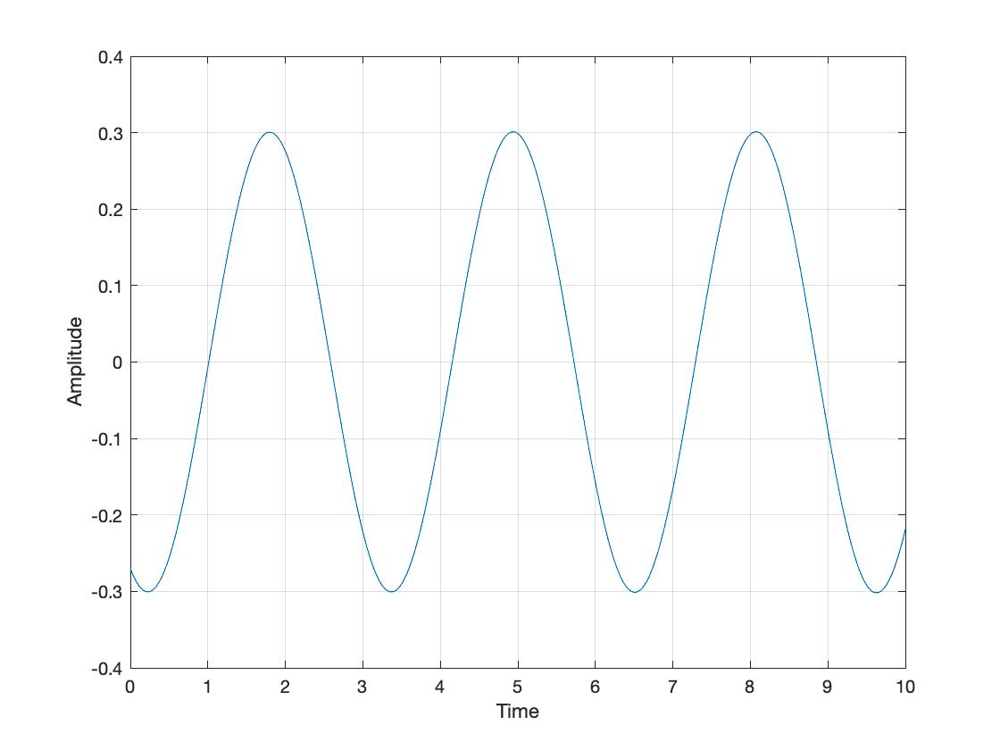
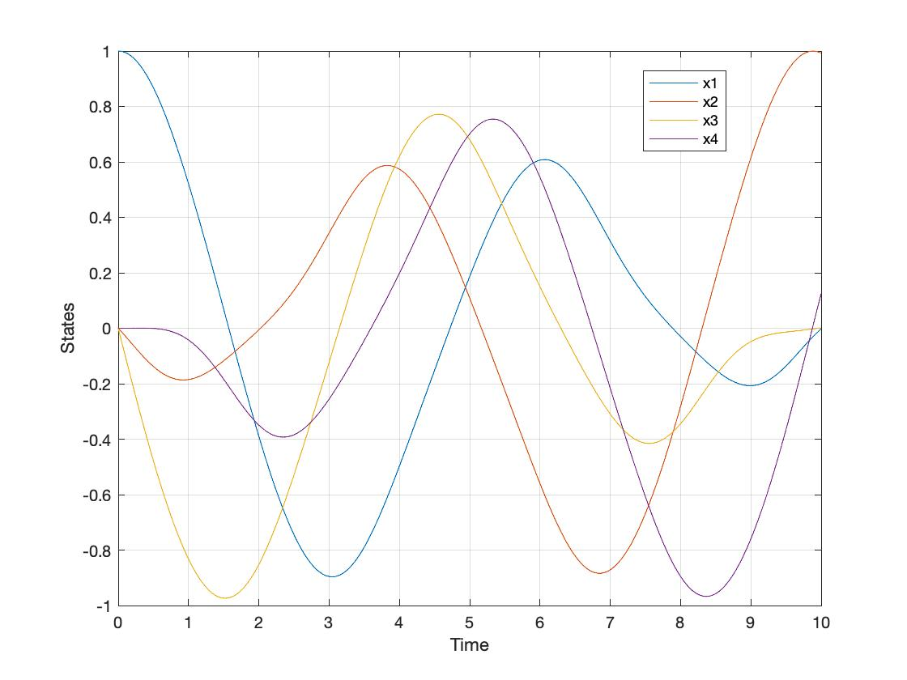
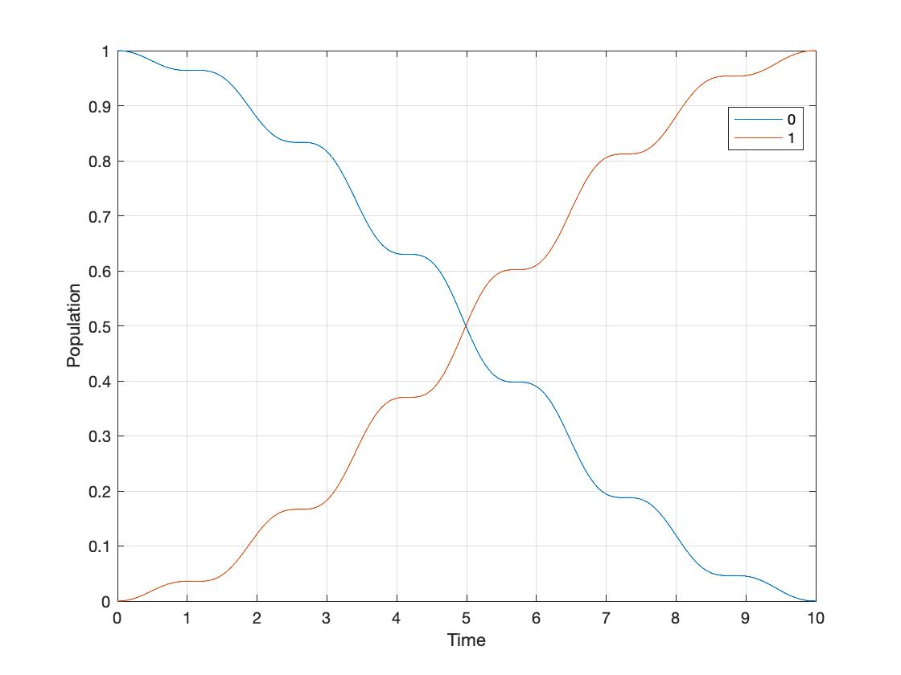

# PRONTO.jl

Hello and welcome to the julia implementation of the **PR**ojection-**O**perator-Based **N**ewton’s Method for **T**rajectory **O**ptimization (PRONTO).


# An Example
```julia
using PRONTO
using StaticArrays, LinearAlgebra
```
The wave function $|\psi(t)\rangle$ is a complex vector evolve in time $t$. We define our state vector 
```math
x = \begin{bmatrix}
Re(|\psi\rangle)\\
Im(|\psi\rangle) 
\end{bmatrix},
``` 
and any complex square matrix $\mathcal{H}$ can be represented in its real form 
```math
H = \begin{bmatrix}
Re(\mathcal{H}) & -Im(\mathcal{H}) \\
Im(\mathcal{H}) & Re(\mathcal{H})
\end{bmatrix}.
```

```julia
function mprod(x) 
    Re = I(2) 
    Im = [0 -1; 1 0] 
    M = kron(Re,real(x)) + kron(Im,imag(x)); 
    return M 
end

function inprod(x) 
    i = Int(length(x)/2) 
    a = x[1:i] 
    b = x[i+1:end] 
    P = [a*a'+b*b' -(a*b'+b*a'); a*b'+b*a' a*a'+b*b'] 
    return P
end
```

## Two Spin System
We consider the Schrödinger equation
```math
i|\dot{\psi}(t)\rangle = (\mathcal{H_0} + \phi(t)\mathcal{H_1})|\psi(t)\rangle,
```
where $\mathcal{H_0} = \sigma_z = \begin{bmatrix}
0 & 1 \\
1 & 0
\end{bmatrix}$, and $\mathcal{H_1} = \sigma_y = \begin{bmatrix}
0 & -i \\
i & 0
\end{bmatrix}$ are the Pauli matrices. The real control input $\phi(t)$ drives the system between 2 qubit states $|0\rangle$ and $|1\rangle$, which are the two eigenstates of the free Hamiltonian $\mathcal{H_0}$. Note that $|\psi \rangle$ is a $2 \times 1$ complex vector here; as a result, $x$ is a $4 \times 1$ real vector. 

We decide to name our model `Spin2`, where `{4,1,3}` represents the 4 state vector $x (|\psi\rangle)$, the single input $u (\phi)$ and the 3 parameters `kl, kr, kq`.

```julia
@kwdef struct Spin2 <: PRONTO.Model{4,1,3}
    kl::Float64 # stage cost gain
    kr::Float64 # regulator r gain
    kq::Float64 # regulator q gain
end
```

For this example, the control objective is to steer the system from the $|0\rangle = [1, 0]^T$ state to the target state $|1\rangle = [0, 1]^T$. We can then define our terminal cost function $m(\psi(T))$ as 
```math
m(\psi(T)) = \frac{1}{2} \langle \psi(T)|P|\psi(T)\rangle = \frac{1}{2} \langle \psi(T)|(I-|1\rangle \langle 1|)|\psi(T)\rangle
```

```julia
function termcost(x,u,t,θ)
    P = I(4) - inprod([0 1 0 0])
    1/2 * collect(x')*P*x
end
```

We convert the the Schrödinger equation
$i|\dot{\psi}(t)\rangle = (\mathcal{H_0} + \phi(t)\mathcal{H_1})|\psi(t)\rangle$ into the system dynamics 
```math
\dot{x}(t) = H(u)x = \begin{bmatrix}
0 & 0 & 1 & 0 \\
0 & 0 & 0 & -1\\
-1 & 0 & 0 & 0\\
0 & 1 & 0 & 0
\end{bmatrix}x + u\begin{bmatrix}
0 & -1 & 0 & 0 \\
1 & 0 & 0 & 0\\
0 & 0 & 0 & -1\\
0 & 0 & 1 & 0
\end{bmatrix}x.
```

```julia
function dynamics(x,u,t,θ)
    H0 = [0 1;1 0]
    H1 = [0 -im;im 0]
    return mprod(-im*(H0 + u[1]*H1) )*x
end
```

For this example, we only consider the use of energy during the process, and we define our incremental cost
```math
\int_0^T l(x,u,t) dt = \int_0^T \frac{kl}{2}u^Tu \quad dt
```
as

```julia
stagecost(x,u,t,θ) = 1/2 *θ.kl*collect(u')I*u
```

### Regulator
For this example, a Linear-Quadratic Regulator (LQR) is used and designed in this way:
```math
R_r(t) = I,\\
Q_r(t) = I - |\psi(t)\rangle \langle \psi(t)|,\\
P_r(T) = Q_r(T) = I - |\psi(T)\rangle \langle \psi(T)|.
``` 
```julia
regR(x,u,t,θ) = θ.kr*I(1)

function regQ(x,u,t,θ) 
    x_re = x[1:2] 
    x_im = x[3:4] 
    ψ = x_re + im*x_im 
    θ.kq*mprod(I(2) - ψ*ψ')
end

PRONTO.Pf(α,μ,tf,θ::Spin2) = SMatrix{4,4,Float64}(I(4) - α*α')
```

We have finished defining our model! Now it is the time to generate the functions so PRONTO can solve the optimization problem.

```julia
PRONTO.generate_model(Spin2, dynamics, stagecost, termcost, regQ, regR)
```
All these functions below are for PRONTO's internal use to solve the problem.
```
[PRONTO: generating the TwoSpin model
    > initializing symbolics...
    > tracing functions for TwoSpin...
        > generated f!(out, x, u, t, θ::TwoSpin)
        > generated Q(x, u, t, θ::TwoSpin)
        > generated R(x, u, t, θ::TwoSpin)
        > generated f(x, u, t, θ::TwoSpin)
        > generated fx(x, u, t, θ::TwoSpin)
        > generated fu(x, u, t, θ::TwoSpin)
        > generated l(x, u, t, θ::TwoSpin)
        > generated lx(x, u, t, θ::TwoSpin)
        > generated lu(x, u, t, θ::TwoSpin)
        > generated lxx(x, u, t, θ::TwoSpin)
        > generated lxu(x, u, t, θ::TwoSpin)
        > generated luu(x, u, t, θ::TwoSpin)
        > generated Lxx(λ, x, u, t, θ::TwoSpin)
        > generated Lxu(λ, x, u, t, θ::TwoSpin)
        > generated Luu(λ, x, u, t, θ::TwoSpin)
        > generated p(x, u, t, θ::TwoSpin)
        > generated px(x, u, t, θ::TwoSpin)
        > generated pxx(x, u, t, θ::TwoSpin)
    > done!
```
For example, we take a look into `fu`, which is the first derivative of our dynamics function `f` 
```math
\dot{x}=H(u)x = \begin{bmatrix}
0 & 0 & 1 & 0 \\
0 & 0 & 0 & -1\\
-1 & 0 & 0 & 0\\
0 & 1 & 0 & 0
\end{bmatrix}x + u\begin{bmatrix}
0 & -1 & 0 & 0 \\
1 & 0 & 0 & 0\\
0 & 0 & 0 & -1\\
0 & 0 & 1 & 0
\end{bmatrix}x
``` 
respect to `u`. Mathematically, `fu` is
```math
\begin{bmatrix}
0 & -1 & 0 & 0 \\
1 & 0 & 0 & 0\\
0 & 0 & 0 & -1\\
0 & 0 & 1 & 0
\end{bmatrix}x = \begin{bmatrix}
                    -x_2\\
                    x_1\\
                    -x_4\\
                    x_3
                 \end{bmatrix}.
```

In PRONTO, `fu` looks like this:
```julia
function PRONTO.fu(x, u, t, θ::TwoSpin)
    out = (MMatrix{4, 1, Float64})(undef)
    @inbounds begin
            out[1] = (*)(-1, (getindex)(x, 2))
            out[2] = (getindex)(x, 1)
            out[3] = (*)(-1, (getindex)(x, 4))
            out[4] = (getindex)(x, 3)
        end
    return (SMatrix{4, 1, Float64})(out)
end
```
They are exactly the same!


We now show how to solve the problem. The initial state is the $|0\rangle$ state `x_eig(1)`, and we start the system at time $0$ `t0` and end at $2$ `tf`.

```julia
x0 = SVector{4}(x_eig(1))
t0,tf = τ = (0,10)
```

### Parameters
```julia
θ = Spin2(kl=0.01, kr=1, kq=1)
```

To initialize our solver, we set the initial guess input $\mu(t) = 0.5\sin(t)$, and then we obtain the intial trajectory $\xi_0 = (\mu,\varphi)$ by solving the open loop problem

```julia
μ = @closure t->SVector{1}(0.5*sin(t))
φ = open_loop(θ,x0,μ,τ)
```

Finally, we are ready to solve the optimization problem! 

```julia
@time ξ = pronto(θ,x0,φ,τ; tol = 1e-5, maxiters = 50, limitγ = true)
```


### Results
If you do this right, you should get:



The top figure is the optimal control input $u(t)$, while the bottom figure is the state vector $x(t)$ evolves in time. We wish to check if we achieve our control objective, which is to steer the system from $|0\rangle$ to $|1\rangle$, the evolution in time of population is shown below
   
